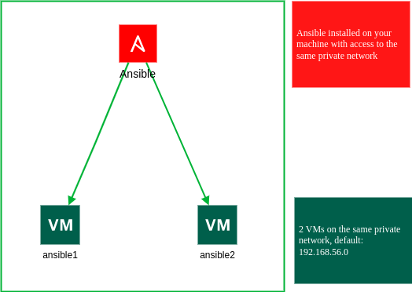

# Ansible Lab Setup for RHCE

This repository provides an automated way to set up an Ansible lab environment for RHCE (Red Hat Certified Engineer) studies using Vagrant and VirtualBox.

## Prerequisites
Ensure you have the following installed on your system:
- [Vagrant](https://developer.hashicorp.com/vagrant/docs/installation)
- [VirtualBox](https://www.virtualbox.org/)
- [Ansible](https://docs.ansible.com/ansible/latest/installation_guide/intro_installation.html) (on your local machine)

## Architecture



## Setup Instructions

### 1. Clone the Repository
```bash
git clone https://github.com/ahmedsmaali5/rhce-lab.git
cd rhce-lab
```

### 2. Start the Virtual Machines
```bash
vagrant up
```
This will create two virtual machines (`ansible1` and `ansible2`) with predefined IP addresses.

### 3. Configure Your Hosts File
Edit your `/etc/hosts` file to map the VM IPs to their respective hostnames:
```bash
sudo nano /etc/hosts
```
Add the following lines:
```
192.168.56.10 ansible1
192.168.56.11 ansible2
```
Save and exit.

### 4. Set Up SSH Key Authentication
To enable passwordless SSH access from your control machine to the Ansible nodes, run:
```bash
ssh-copy-id ansible@ansible1
ssh-copy-id ansible@ansible2
```
Enter the `ansible` user's password when prompted.

### 5. Test Ansible Connectivity
Run the Ansible `ping` module to verify the setup:
```bash
ansible all -m ping
```
If everything is set up correctly, you should see a successful response from both `ansible1` and `ansible2`.

## Notes
- This lab is designed for RHCE exam preparation and follows best practices for setting up an Ansible control node.
- You can modify the Vagrantfile to add more nodes if needed.
- Used box is [centos8] (https://portal.cloud.hashicorp.com/vagrant/discover/centos/8) you can change it if needed.

Happy learning & Good luck on your exam!

